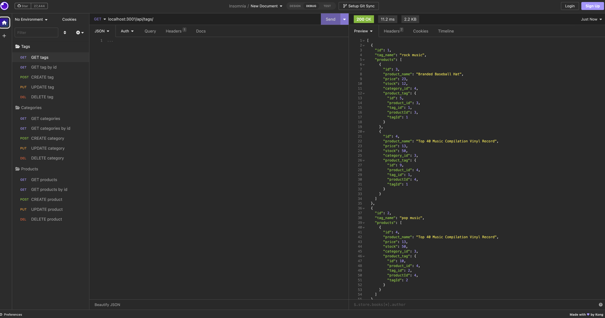

# 13 Object-Relational-Mapping

## Description 
For the module 13 assignment I built an e-commerce back end in JavaScript. Product, category, and tag data are stored in a MYSQL database. The application uses Sequelize to connect to the database and there are API POST, PUT, and DELETE routes for users to create, update, and delete information in the database.

A demo of the tool can be found here: https://drive.google.com/file/d/1gwiRXqaJVjnSc-nXhSeg8-LZm2XFGVDu/view

## Installation
To install node on mac, use `brew install nvm` and `nvm install 16`.
Use `npm install` to install the Sequelize, dotenv, and Express package along with the other required packages.
An `.env` file also needs to be created with local MYSQL login information and database name.

## Usage
The user will need to create the schema from the MYSQL shell and seed the database. Use Insomnia Core to create, update, and delete product, category and tag information in the database.

## User Story

```
AS A manager at an internet retail company
I WANT a back end for my e-commerce website that uses the latest technologies
SO THAT my company can compete with other e-commerce companies
```

## Acceptance Criteria 

```
GIVEN a functional Express.js API
WHEN I add my database name, MySQL username, and MySQL password to an environment variable file
THEN I am able to connect to a database using Sequelize
WHEN I enter schema and seed commands
THEN a development database is created and is seeded with test data
WHEN I enter the command to invoke the application
THEN my server is started and the Sequelize models are synced to the MySQL database
WHEN I open API GET routes in Insomnia Core for categories, products, or tags
THEN the data for each of these routes is displayed in a formatted JSON
WHEN I test API POST, PUT, and DELETE routes in Insomnia Core
THEN I am able to successfully create, update, and delete data in my database
```

## Mock-Up

The following image shows the application's appearance and functionality using Insomnia Core:




